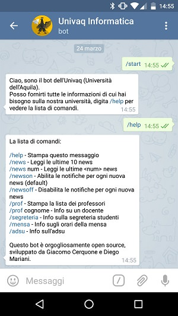
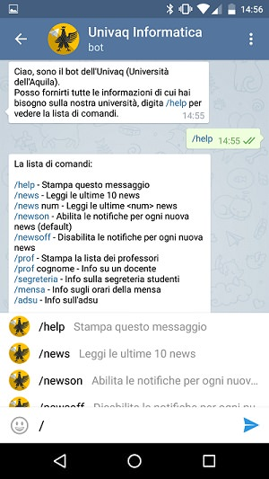
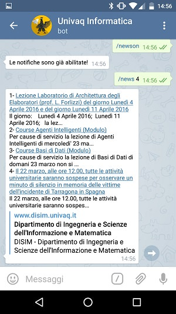
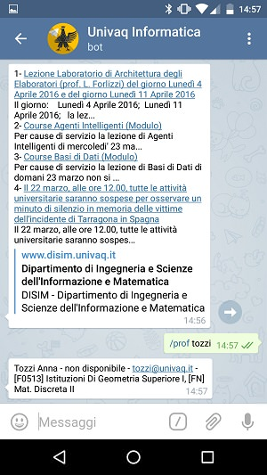

## Univaq Bot - Faculty of Computer Science

This is an **unofficial** [telegram bot](https://telegram.org/blog/bot-revolution), for the [University of L'Aquila](http://univaq.it).

We built it to provide a single and simple source of information for students of University of L'Aquila, in particular for the faculty of Computer Science (aka [disim](http://www.disim.univaq.it)).

All information is acquired, scraped, parsed, stored and synchronised using a bunch of Python scripts.

**Read the [blog post](http://blog.giacomocerquone.com/how-we-built-our-university-s-bot/) for further information**

### Screenshots
 |  | 
--- | --- | ---
 |

### Start using it

You can start using the univaq telegram bot by searching in the Telegram app for [@univaq_informatica_bot](https://telegram.me/univaq_informatica_bot)

### How does it work

The telegram bot provides students with up-to-date information on professors, facilities and news about the university, **without needing to repeatedly visit the university website**, the univaq telegram **bot does the work so you don't have to!**

### Functionalities

As with every telegram bot, you can ask the bot what does by entering `/help` or even `/start`

```sh
La lista di comandi:

/help - Stampa questo messaggio
/news - Leggi le ultime 10 news
/news num - Leggi le ultime <num> news
/newson - Abilita le notifiche per ogni nuova news (default)
/newsoff - Disabilita le notifiche per ogni nuova news
/prof - Stampa la lista dei professori
/prof cognome - Info su un docente
/segreteria - Info sulla segreteria studenti
/mensa - Info sugli orari della mensa
/adsu - Info sull\'adsu
```

### CONTRIBUTING
We accept of course every kind of contribution and if you're going to submit pull requests to this project, we kindly ask you to do so on the `dev` branch.
For further information on code style, please read `srs-outline` inside the docs folder. Thank you very much.

**The list of commands will be updated**. We are currently thinking of possible improvements and extensions.  If you have suggestions for us, please consider opening an `issue` above.

### Notifications

The **univaq telegram bot also provides a push notification service**. When new unread news is published on the university website, the univaq telegram bot can send it to you via a push notification (you can activate/deactivate this notification service in any time using the bot commands).

### Website

The website of univaq telegram bot is http://univaqtelegrambot.github.io/

### TODO

1. Implement the ability to search professors from their subjects.
2. Implement in some way (maybe scraping pdf documents) the lessons timetables with their notifications.
3. Implement notifications on new jobs that appears on the University's website.

### DISCLAIMER

**THIS PROJECT IS NOT OFFICIALLY AFFILIATED WITH UNIVAQ INSTITUTION**

It's an open source project built for didactic purposes.  Please help us to make it better.
